---

# Hangman

This game is a Python terminal project which is, first and foremost, intended to be fun to play.  Users can try to improve their own performances, and can try to better their friends'.

While the users are playing the game, they are improving their vocabulary.  They are also improving their spelling skills.

Users can quickly learn the rules of the game and proceed to play.  Certain messages displayed to the user remind them of certain rules.

The game can be accessed by this [link](https://hangman-5f3cd9b4e6da.herokuapp.com)

---

## How to play:

  1. Click this [link](https://hangman-5f3cd9b4e6da.herokuapp.com) or copy this text: `https://hangman-5f3cd9b4e6da.herokuapp.com` and paste it in your browser's address bar.
  1. As soon as the page is loaded, the menu is presented.
  1. Select option [2] to familiarise yourself with the rules.
  1. Select option [1] to begin playing.
  1. Follow the onscreen prompts and messages to advance through each hidden word presented.
  1. When you are ready to finish playing, select option [3] from the menu to exit the game.  
  1. Don't forget to send the link to this game to your friends!

The game can be accessed by this [link](https://hangman-5f3cd9b4e6da.herokuapp.com)

---

## User Stories
### First Time Visitor Goals:

* As a first time visitor, I want to quickly understand the program's primary purpose, so that I can learn more about it.
* As a first time visitor, I want to navigate through the program easily, so that I can find the content.
* As a first time visitor, I want to find the program useful for myself, so that I can meet my expectations.
* As a first time visitor, I want to see different text colours, so I can easily read the screen.

### Frequent Visitor Goals:
* As a frequent user, I want to be able to increase my vocabulary.
* As a frequent user, I want to be able to improve my spelling skills.
* As a frequent user, I want to be able to compete with friends on vacabulary and spelling.

---

## Features 

- __Options screen__

  - As soon as the page is loaded, the user is greeted by a welcome message.
  - Below the welcome message is a menu which presents the user with 3 options:

    1. Play game

    1. Show rules

    1. Exit

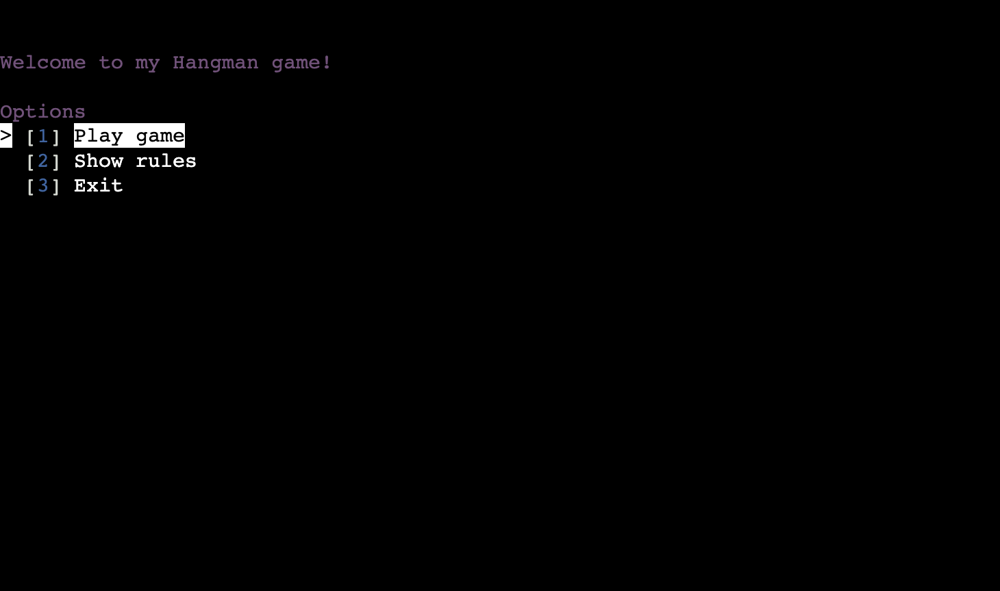

  - Menu options can be selected with the arrow, j/k, or emacs (C-n/C-p) keys.  When the desired option is highlighted, the enter or return key accepts the choice for the user.
  - The user can also use the shortcut keys which are the 1, 2, and 3 keys.

---

- __Rules screen__

  - Here the users are presented with the 9 rules of this particular implementation of the hangman game.
  - Below the rules, the user can find the main menu again where they can choose another option.

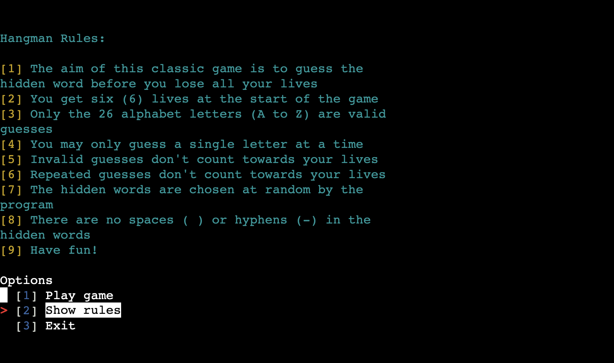

---

- __Play game screen__

  - When the users choose the option [1] to play game, they are presented with this first game screen.
  - They see 2 messages, the first telling them how many lives they have, the second showing them the hidden word.
  - The lives message is in red text with a white background, as lives are critical to the game play.
  - The number of letters in the hidden word are indicated by the same number of underscores (_).  This is in green text.
  - At the bottom of the screen is the prompt for user input, asking them to guess a letter.

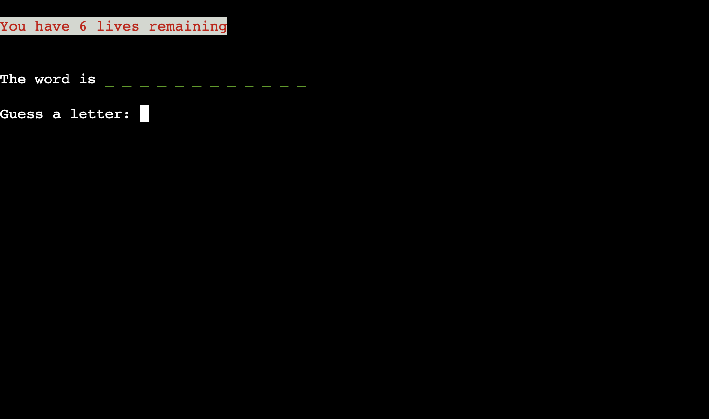

---

- __Correct guess screen__

  - When the users guess a letter which is contained in the hidden word, they are presented with a message in green text.
  - The users are also told how many times their correctly guessed letter appears in the hidden word.
  - Their number of lives is shown again to them, which will not have changed as they just correctly guessed a letter.
  - Next is the message which keeps track of all the letters they will have guessed through the current hidden word.
  - These letters are presented in alphabetical order for ease of reference.  They are in yellow text.
  - Next is the hidden word again, represented by the underscores for the letters yet to be guessed, and the correctly guessed letters also in green text.
  - The game continues through the promt for user input again, asking to guess a letter.

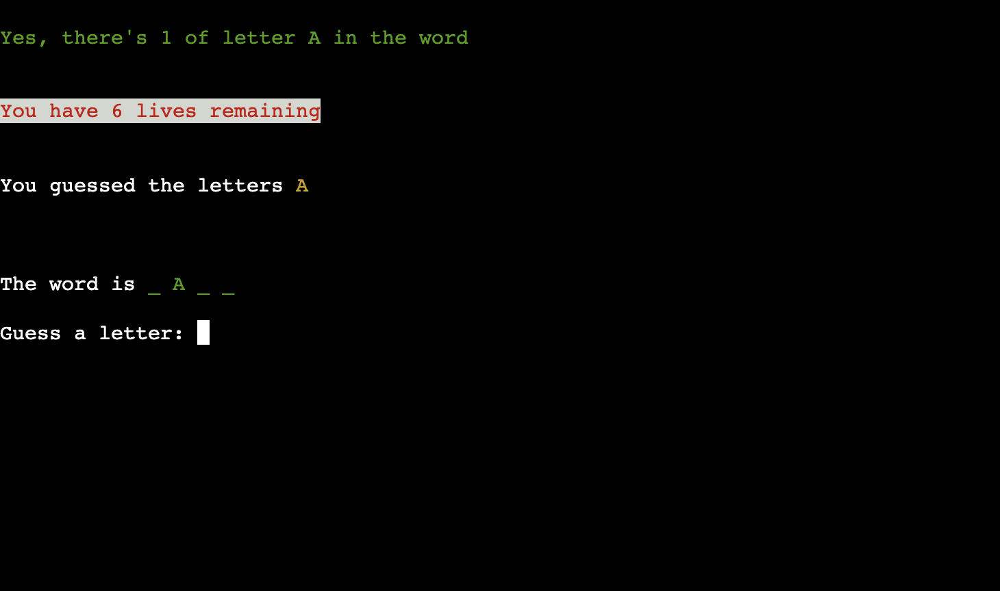

---

- __Incorrect guess screen__

  - When the users guess a letter which is not contained in the hidden word, they are presented with a message in red text.
  - As a check and feedback to the user, the message repeats back the letter the user just guessed incorrectly.
  - Their number of lives is shown again to them, which will have reduced by 1 as they just incorrectly guessed a letter.
  - Next is the message which keeps track of all the letters they will have guessed through the current hidden word.
  - These letters are presented in alphabetical order for ease of reference.  They are in yellow text.
  - Next is the hidden word again, represented by the underscores for the letters yet to be guessed, and the correctly guessed letters also in green text.
  - The game continues through the promt for user input again, asking to guess a letter.

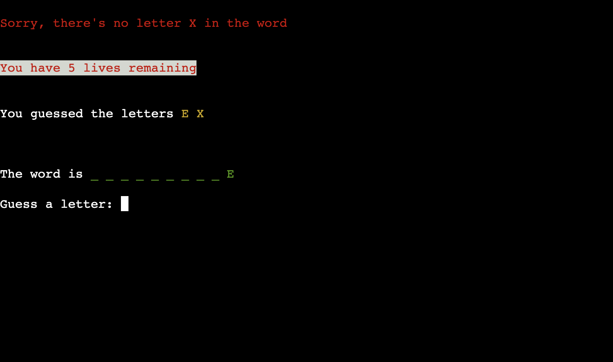

---

- __Invalid guess screen__

  - When the users enter a character/s other than the single 26 alphabet letters A to Z, they are presented with a message in red text.
  - As feedback to the user, the message reminds them of the rules, and assures them they have not just expended a life.
  - Their number of lives is shown again to them, which will not have reduced as they just guessed an invalid entry.
  - The game continues through the promt for user input again, asking to guess a letter.

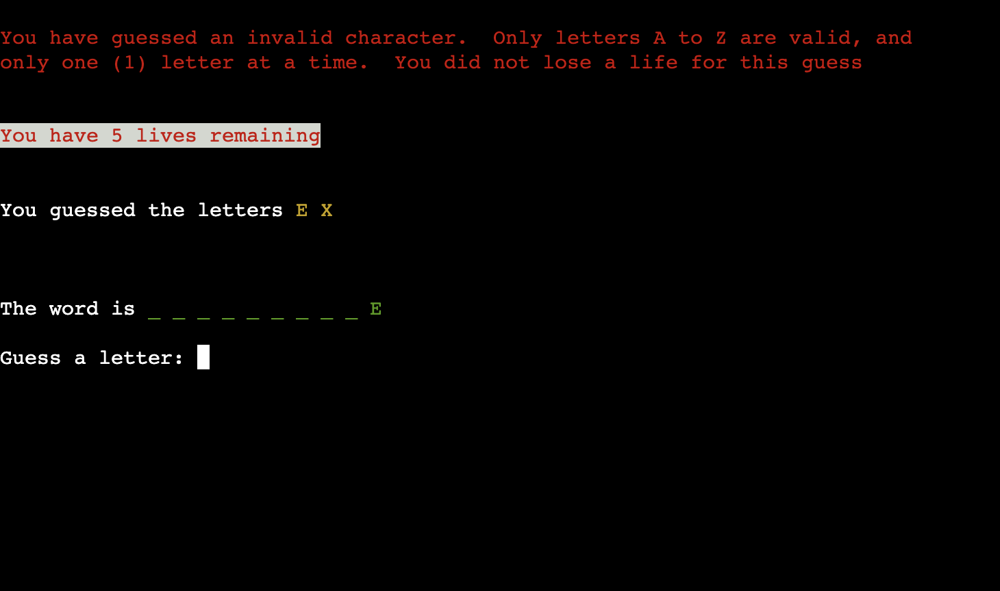

---

- __Already guessed screen__

  - When the users guess a letter they have already guessed, whether correctly or not, they are presented with a message in blue text.
  - As a check and feedback to the user, the message repeats back the letter the user just guessed again.  It also assures them they have not just expended a life
  - Their number of lives is shown again to them, which will not have reduced as they just guessed a repeated guess.
  - The game continues through the promt for user input again, asking to guess a letter.

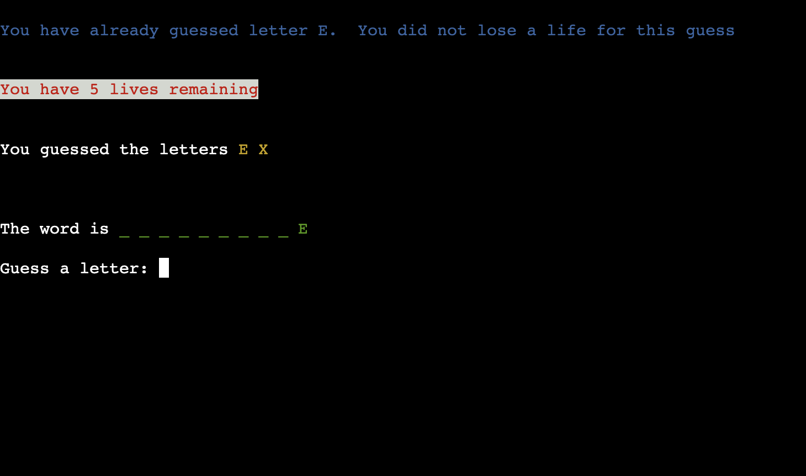

---

- __Died screen__

  - If the users lose all 6 of their lives, they are presented with a message in red text with a white background, informing them they have no lives remaining and so 'have died'.
  - The answer to the hidden word is presented in green text with white background, as feedback to the user and for their learning.
  - Below the answer, the user can find the main menu again where they can choose to play again, revisit the rules, or exit.

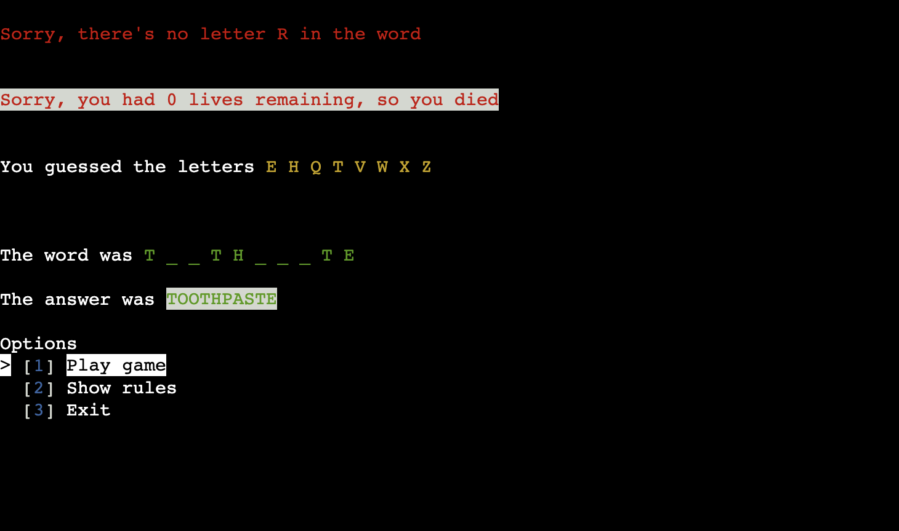

---

- __Lived screen__

  - If the users correctly guess all the letters in the hidden word before losing all 6 of their lives, they are presented with a message in green text congratulating them, and showing the answer word with a white background, to confirm their guesses.
  - Below the answer, the user can find the main menu again where they can choose to play again, revisit the rules, or exit.

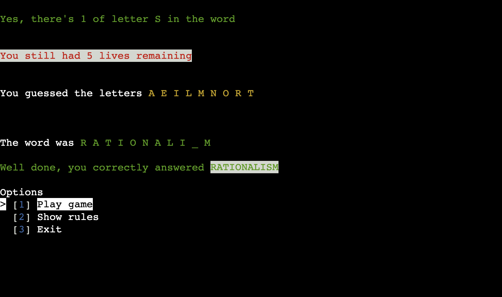

---

- __Exit screen__

  - If the users select the exit option [3] from the main menu, they are presented with a message in magenta thanking them for playing.

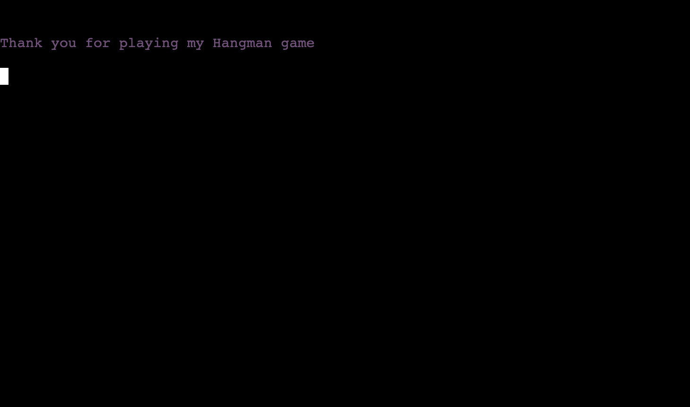

---

## Technologies Used

### Languages:

- [Python 3.12.2](https://www.python.org/downloads/release/python-3122): used to drive all application behavior

### Frameworks/Libraries, Programmes and Tools:
#### Python modules/packages:

##### Standard library imports:

- [os](https://docs.python.org/3/library/os.html) was used to clear the terminal while running the program.
- [random](https://docs.python.org/3/library/random.html) was used to implement pseudo-random number generation.
- [string](https://docs.python.org/3/library/string.html) was used to determine the valid acceptable characters.
- [time.sleep](https://docs.python.org/3/library/time.html#time.sleep) was used to delay the screen by seconds.

##### Third-party imports:

- [Simple Terminal Menu](https://pypi.org/project/simple-term-menu) was used to implement the menu.
- [Colorama](https://pypi.org/project/colorama) was used to add colors and styles to the project.

#### Other tools:

- [GitPod](https://gitpod.io) was used as the main tool to write and edit code.
- [GitHub](https://github.com) was used to host the code and for version control.
- [Heroku.com](https://heroku.com) was used to deploy the project.

---

## Bugs

+ Unsolved bugs
    - A 'TypeError: list indices must be integers or slices, not NoneType' exception is raised when the Escape key is used during the main menu

## Testing

The application was tested continuously during its development.

### Validators

No errors were found:

- run.py

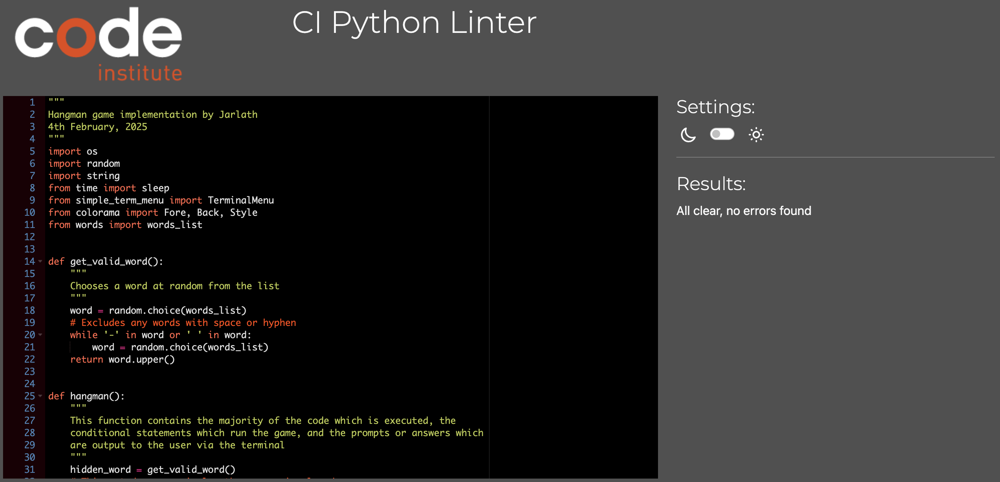
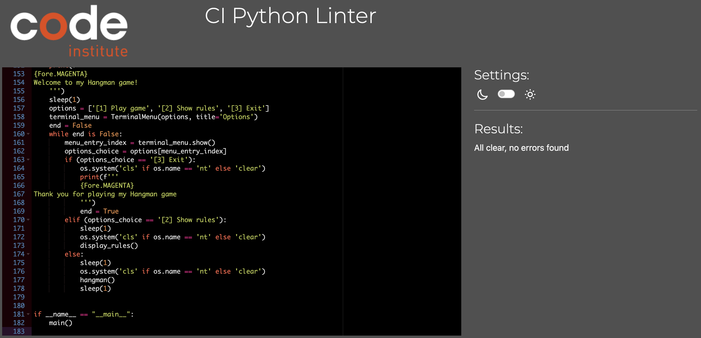

- words.py

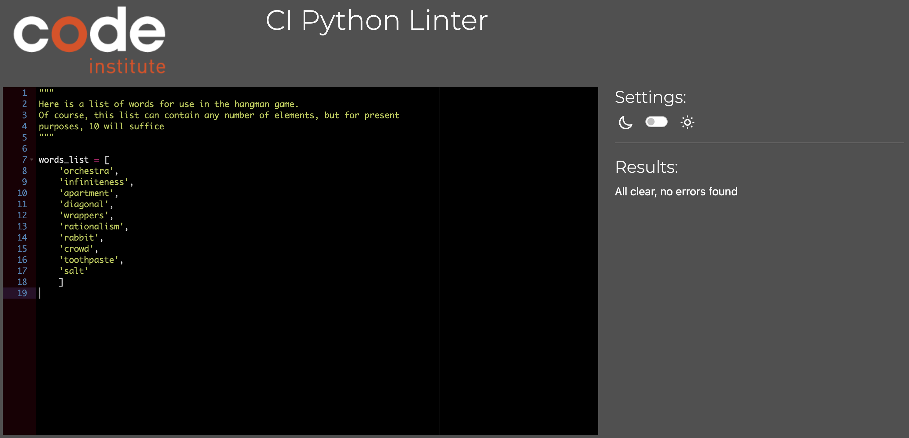

---

## Deployment

- The application was deployed through [Heroku](https://dashboard.heroku.com/apps)
- The application can be accessed at the [link](https://hangman-5f3cd9b4e6da.herokuapp.com)

### To deploy the application to Heroku so it can be run as a remote web application:

- Clone the repository:
  1. Open a folder on your computer with the terminal.
  1. Run the following command
  - `git clone https://github.com/JarlathMacS/hangman.git`

  1. Create your own GitHub repository to host the code.
  1. Run the command `git remote set-url origin <Your GitHub Repo Path>` to set the remote repository location to your repository.

  1. Push the files to your repository with the following command:
  `git push`
  1. Create a Heroku account if you don't already have one here [Heroku](https://dashboard.heroku.com).
  1. Create a new Heroku application on the following page here [New Heroku App](https://dashboard.heroku.com/apps):

      - 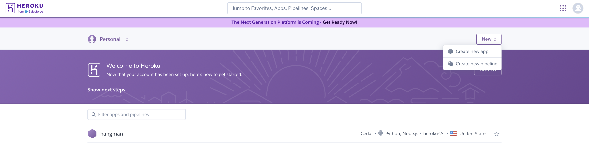

  1. Go to the Deploy tab:

      - 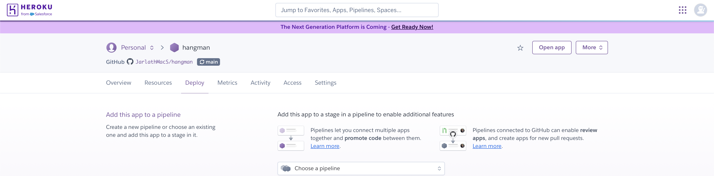

      - 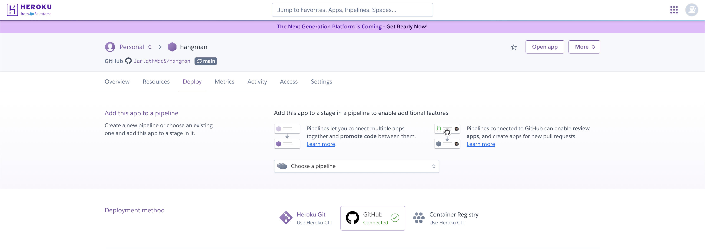

  1. Link your GitHub account and connect the application to the repository you created.

      - 

  1. Go to the Settings tab:
  
      - 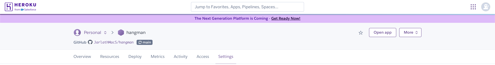

  1. Click "Add buildpack":

  1. Add the Python and Node.js buildpacks in the following order:

      - 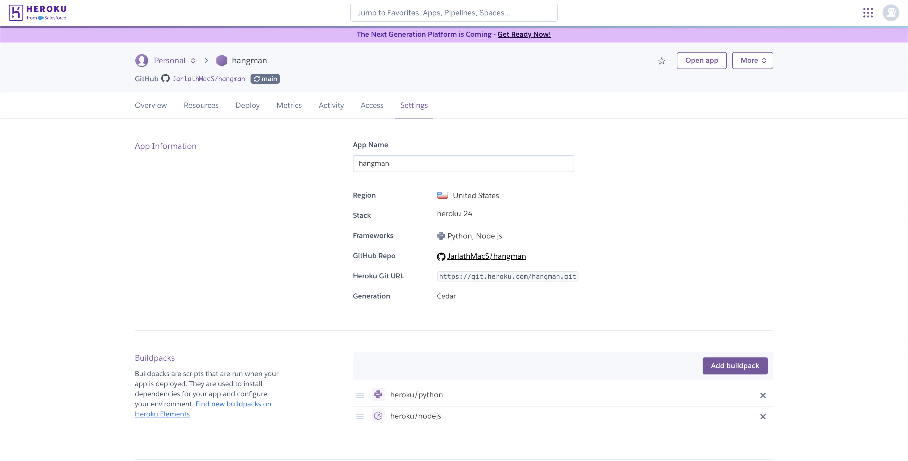

  1. Go back to the Deploy tab:

      - 

  1. Click "Deploy Branch":

      - 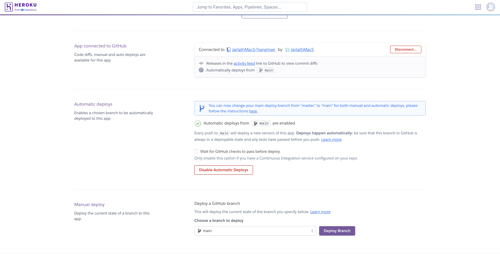

      - Wait for the completion of the deployment.

      - 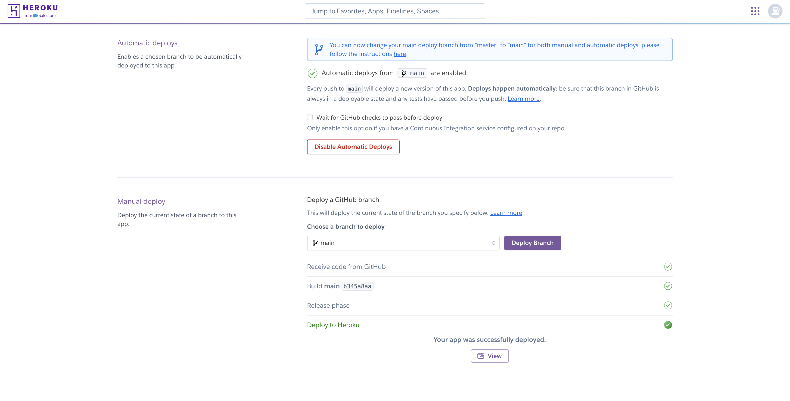

  1. Click "Open app" to launch the application inside a web page.

## Credits

- The idea for this game was inspired by [Kylie Ying's](https://www.youtube.com/c/YCubed) [12 Beginner Python Projects - Coding Course](https://www.youtube.com/watch?v=8ext9G7xspg&t=1465s) on [freeCodeCamp.org](https://www.youtube.com/c/Freecodecamp) YouTube channel.
- Color formatting: [Colorama](https://pypi.org/project/colorama).
- Terminal menu: [Simple Terminal Menu](https://pypi.org/project/simple-term-menu).

## Acknowledgements

[Iuliia Konovalova](https://github.com/IuliiaKonovalova)

I am very grateful to my mentor Iuliia Konovalova for her direction and feedback